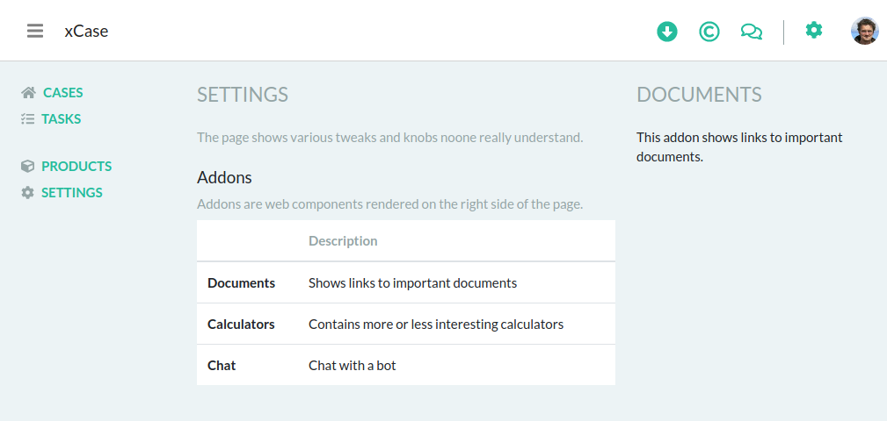

# xCase

This is a prototype project for generic case management system. For demo, [click here](https://xcase-test.herokuapp.com).

## What it does

The prototype demonstrates the follows:
- concept of generic case menagement system of various types (products)
- use of web components, both as separate side/helper view as well as a part of case/product UI implementation

### Cases
The prototype shows a list of cases of viarious types. The first one (Jan Novak) shows a case of a known type (ihypo type), therefore it includes a complete information, including a collapsible case overview. The case may even be edited, if the business circumstances allows that.


The second case (Mary Vomaczkowa) represents a case of an unknown type. Therefore it is grayed-out and cannot be previewed and/or edited.

### Tasks
There is no real implementation of task delivery, it is expected to integrate with some of semi/standard workload management systems. Once this is done, the UI may serve current user's tasks, again, being handled by web components-based editors.

### Products
Every case type (also called a product) need to be registered within the system. The *Products* page shows a list of known products, you may explore them o register new one. To add new type, click the plus sign and choose appropriate case descriptor (json) file. For the case descriptor file, see [this test file](server/test/product.json).

Once registered, the new case type is applied immediately and the second case gets appropriate icon and overview.

Product definition/configuration consists of an icon, several data elements (overview, create and edit web component urls) and a set of context actions. Every action may be displayed as 
- a dialog,
- a page element, preserving the header/navigation bars,
- a new separate window/tab (useful for download actions, for example).

### Settings
The settings page contains a list of addon components available under top-right header icons. Every icon displays right-aligned sidebar with appropriate component, for example a list of documents, calculators or chat.



All components are registered independently on products, howsever, they are based on the same web components technology.

## Implementation

Components are registered by [product](client/ProductsContext.js) and [application](client/AppContext.js) contexts during their initialization phase (see useEffect -- a new `script` element is created, configured and attached to document body). To use the component, a dynamically-named component is constructed and used as overview, see [CaseOverview](client/components/CaseOverview.js) component.

### Rendering 

To implement an component, a [web componets standard](http://webcomponents.org) should be used. Here is an example of the [IHYPO case type overview](client/static/ihypo-overview.js). Please note, the component must be registered under appropriate name.

```
class IHypoOverview extends HTMLElement {
  connectedCallback () {
    const amount = this.getAttribute('loanamount') || 0;
    const amountFmt = amount < 1000000 ? amount/1000 + 'K' : amount/1000000 + 'M';
    this.innerHTML = `Mortgage, ${amountFmt} CZK, 15 years, 2 applicants`;
  }
}

customElements.define('ihypo-overview', IHypoOverview)
```
The 'loanamount' attribute is propagated into the webcomponent from the case data in form of attribute and respective value. Checkout the [CaseOverview](client/components/CaseOverview.js) for details.

To propagate certain information back into the host application, the web components has to use the CustomEvent mechanism. The host application must expect the event to come, for example, the ihypo-create.js uses the event to propagate the process start event as follows:
```
const submitButton = document.getElementById('submitButton');
submitButton.onclick = (event) => {
  event.preventDefault();
  this.dispatchEvent(new CustomEvent("submit", { detail: ... }));
} 
```

### Angular

The [xhypo-overview](lib/xhypo-overview) component is implemented using Angular and Angular Elements. No source since this is crazy chatty framework and there are bits and webcomponents-relevant pieces all over the place.

### React

The [xhypo-create](lib/xhypo-create) component is implemented using React and [react-webcomponentify](https://www.npmjs.com/package/react-webcomponentify).
```
import React from "react";
import { registerAsWebComponent } from "react-webcomponentify";

export const XHypoCreateComponent = props => (
    <div>Hello from React World</div>
);

registerAsWebComponent(XHypoCreateComponent, "xhypo-create");
```

### Vue

The [xhypo-detail](lib/xhypo-detail) component is implemented using Vue.
```
<template>
  <div>Welcome from Vue World</div>
</template>

<script>
export default {
  name: "xhypo-detail",
  components: {},
  data() {},
  methods: {}
};
</script>

<style lang="scss">
</style>
```

### Furure framework

Use your future fancy framework as long as it supports the webcomponents standard. 
Use webcomponents, stop the framework wars, do something meaningful.

## Next steps

The existing code shows implementation of webcomponents-based case list using React/Node. This is very basic implementation, may be extended heavily.

For the application

- [ ] enable addon configuration (register, reorder, remove)
- [ ] think about addon/component lifecycle and initialization
- [ ] allow registering case-type/product-specific settings component
- [ ] consider versioning and rollbacks of misbehaving JSONs
- [ ] consider receiving and displaying notifiations (simple JSON endpoint)
- [ ] implement proper create and edit endpoints

For documents addon

- [ ] integrate with some CMS, display proper content

For calculators addon

- [ ] implement a simple calculator

For chat addon

- [ ] handle options properly, maybe show as dialog + selected option as user's statement in the chat
- [ ] implement delete functionality (uses dialog action type)
- [ ] implement download functionality (uses window action type)


