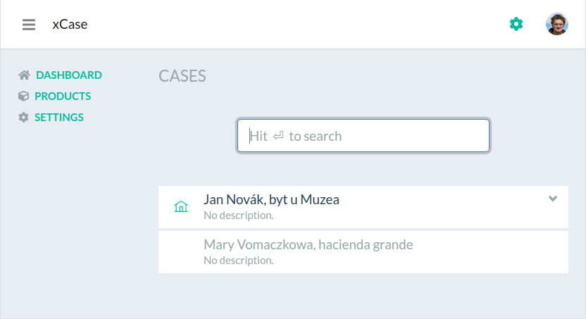
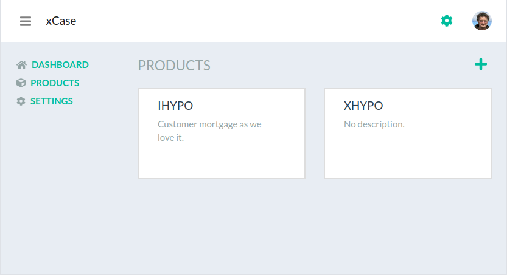
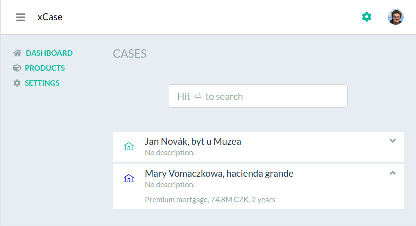

# xCase

This is a prototype project for generic case management system. For demo, [click here](https://xcase-test.herokuapp.com).

## What it does

The prototype shows a list of cases of viarious types. The first one (Jan Novak) shows a case of a known type (ihypo type), therefore it includes a complete information, including a collapsible case overview. The case may even be edited, if the business circumstances allows that.



The second case (Mary Vomaczkowa) represents a case of an unknown type. Therefore it is grayed-out and cannot be previewed and/or edited.

> Don't worry, the missing type will be registred later in the text.

## Case types

Every case has a unique type associated to it and may be seen as a representation of a product. There are certain attributes associated with every type:

- product icon
- a reference (url) to an overview, [webcomponets](http://webcomponents.org)-based component

There will be more to configure, this is just a prototype.

## Registering new type

To register a new product type, navigate to a products section, showing all known case types. To add new type, click the plus sign and choose appropriate case descriptor (json) file. Successfully registered type should look like this:



For the case descriptor file, see [this test file](server/test/product.json).

Once registered, the new case type is applied immediately and the second case gets appropriate icon and overview.



## Implementation notes

- components are registered by [products context](client/ProductsContext.js) during it's initialization phase (see useEffect -- a new `script` element is created, configured and attached to document body),
- to use the component, a dynamically-named component is constructed and used as overview, see [CaseOverview](client/components/CaseOverview.js) component.

To implement an overview, a [webcomponets.org](http://webcomponents.org) should be used. Here is an example of the [IHYPO case type overview](client/static/ihypo-overview.js). Please note, the component must be registered under appropriate name (`<type-name>-overview`).

```
class IHypoOverview extends HTMLElement {
  connectedCallback () {
    const amount = this.getAttribute('loanamount') || 0;
    const amountFmt = amount < 1000000 ? amount/1000 + 'K' : amount/1000000 + 'M';
    this.innerHTML = `Mortgage, ${amountFmt} CZK, 15 years, 2 applicants`;
  }
}

// register the new custom element
customElements.define('ihypo-overview', IHypoOverview)
```

The 'loanamount' attribute is propagated into the webcomponent from the case data in form of attribute and respective value. Checkout the [CaseOverview](client/components/CaseOverview.js) for details.

> Correct, the overview is not neccesarily accurate for all the cases.

## Summary and next steps

The existing code shows implementation of webcomponents-based case list using React/Node. This is very basic implementation, may be extended heavily

- [implement proper overview, showing real data](https://github.com/jaroslavpsenicka/xcase/issues/1) - completed, sample overview implemented for both ihypo and xhypo products
- [implement proper case-type/product detail page showing details of registered JSON](https://github.com/jaroslavpsenicka/xcase/issues/2) - completed, shows basic data as well as components, with links to source
- [implement a case editor web component](https://github.com/jaroslavpsenicka/xcase/issues/3) - implemented for ihypo product, includes "hardcoded update" for particular demo scenario only 
- [implement some form of a new case button and use appropriate web component to create case](https://github.com/jaroslavpsenicka/xcase/issues/4) - implemented for ihypo product, includes "hardcoded create" for particular demo scenario only 
- [implement better validations during JSON upload](https://github.com/jaroslavpsenicka/xcase/issues/5), incl. webcomponent checks
- [implement some components](https://github.com/jaroslavpsenicka/xcase/issues/6) using [Angular](https://medium.com/@IMM9O/web-components-with-angular-d0205c9db08f)/[React](https://dev.to/frustigor/the-fastest-way-to-create-web-components-with-react-403)/[Vue](https://dev.to/aumayeung/create-web-components-with-vue-js-2bb0)
- [allow registering custom case actions](https://github.com/jaroslavpsenicka/xcase/issues/6), including the show-webcomponent-in-a-dialog feature
- [allow registering case-type/product-specific settings component](https://github.com/jaroslavpsenicka/xcase/issues/7)

lower priority tasks:

- allow processing REST or Kafka-based events, for example case creation notification
- consider using [shadow DOM in webcomponents](https://www.grapecity.com/blogs/using-web-components-with-react-2019), [TM crash course](https://www.youtube.com/watch?v=PCWaFLy3VUo)
- consider versioning and rollbacks of misbehaving JSONs
- consider receiving and displaying notifiations
